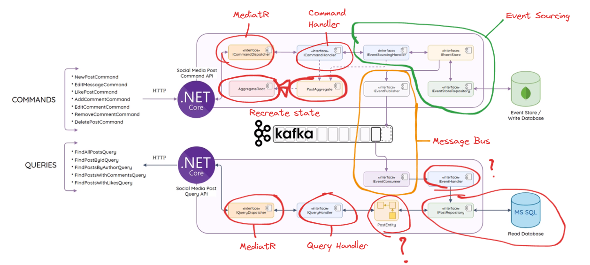

## Microservices in .NET

This repository showcases the implementation of a social media post management system with clear separation of Command (Write) and Query (Read) responsibilities, following best practices in distributed system design. The architecture incorporates the following component.

## Features and Components

### **Command Side (Write Operations):**

- **Command API**: Processes all write-related commands like creating, editing, liking posts, and managing comments.
- **Commands**: Includes commands like `NewPostCommand`, `EditMessageCommand`, `LikePostCommand`, and more.
- **Aggregate Root**: Centralizes business logic and ensures consistency for domain operations.
- **Event Sourcing**: Every state change is stored as an immutable event in the **Event Store** (using MongoDB).
- **Event Publishing**: Events are sent to Kafka, enabling eventual consistency and communication with other services.
- **Command Handlers**: Implements business logic for handling commands using interfaces like `ICommandHandler`.

### **Query Side (Read Operations):**

- **Query API**: Exposes endpoints for retrieving data like posts by ID, posts by author, or posts with likes/comments.
- **Queries**: Includes queries like `FindAllPostsQuery`, `FindPostsByAuthorQuery`, and more.
- **Query Handlers**: Efficiently fetches data from the read database (MSSQL) based on specific query requirements.
- **Read Model**: Keeps a denormalized view of data in MSSQL, updated via Kafka consumers listening for domain events.

### **Event Sourcing & Messaging:**

- **Event Store**: A write-ahead log implemented with MongoDB, storing all domain events to recreate the aggregate state if needed.
- **Kafka**: Serves as the message bus for event-driven communication between services. Ensures reliable publishing and consumption of domain events.
- **Event Consumers**: Updates the read database in response to events published from the command side.

---

## Core Technologies

- **.NET Core**: Backend framework for building the Command and Query APIs.
- **Docker Compose**: Simplifies the setup of the microservices architecture by orchestrating multiple containers for the Command API, Query API, Kafka, MongoDB, and MSSQL, ensuring seamless local development and testing.- **MediatR**: Simplifies communication between layers by dispatching commands and queries to their respective handlers.
- **MongoDB**: Serves as the Event Store for write operations.
- **MSSQL**: Serves as the Read Database for denormalized query responses.
- **Kafka**: Manages event publishing and consumption for message-driven architecture.
- **CQRS Pattern**: Cleanly separates write and read operations, enabling scalability and maintainability.
- **Event Sourcing**: Ensures a reliable, immutable history of all changes in the system.

---

## How It Works

1. **Commands**:
   - A client sends a command via the Command API.
   - The **Command Handler** processes the command, applies business logic, and stores the resulting event in the Event Store.
   - The event is published to Kafka for other services to consume.
2. **Queries**:
   - A client sends a query to the Query API.
   - The **Query Dispatcher** routes the query to the appropriate Query Handler.
   - The Query Handler fetches data from the MSSQL database and returns it to the client.
3. **Event-Driven Updates**:
   - Events published to Kafka are consumed by the **Event Handlers** on the Query Side.
   - The Event Handlers update the MSSQL database with the latest state, ensuring eventual consistency.
